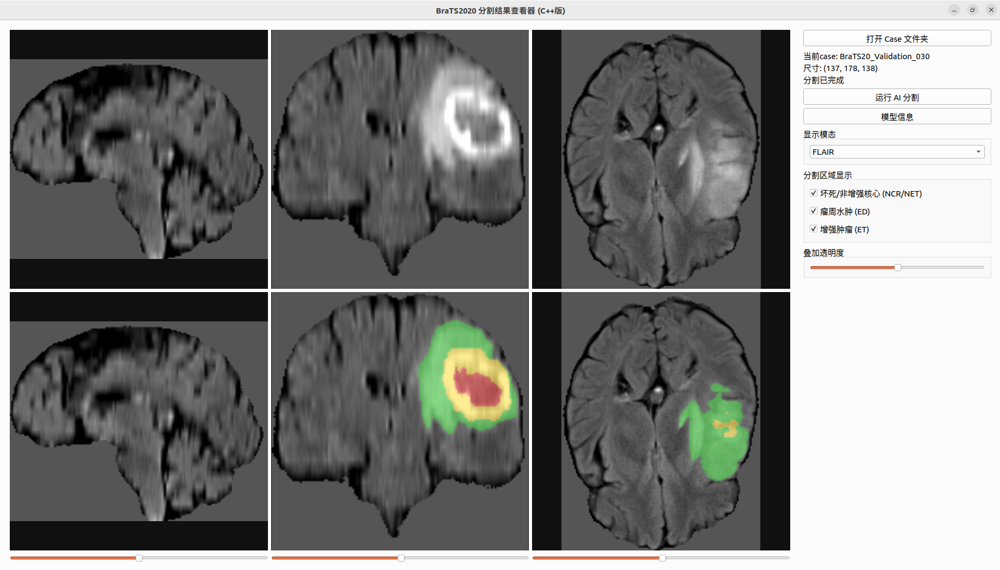

# BraTS2020 脑肿瘤分割可视化系统

基于 Qt + ITK + TensorRT 构建的脑肿瘤 MRI 分割桌面应用，模型使用 MONAI SegResNet 在 BraTS2020 数据集上训练。项目模拟了一条完整的"训练 → 模型导出 → 嵌入式推理部署 → 可视化展示"工程链路。

## 项目背景

本项目分为两个独立仓库：

- **模型训练仓库**（Python）：负责数据预处理、SegResNet 训练、评估与诊断，最终导出 ONNX 模型
- **本仓库**（C++/Qt）：消费上述 ONNX 模型，实现独立于 Python 的完整推理与可视化 pipeline

两个仓库之间的交接物是 `model.onnx` 及配套的预处理规范，详见下文"模型交接规范"部分。

## 效果预览

> 6 面板布局：上排为原始 MRI 三视图，下排为对应的分割结果叠加视图。分割区域用红/绿/黄三色分别标注坏死核心(NCR)、水肿(ED)、增强肿瘤(ET)。



## 技术栈

| 模块 | 技术选型 |
|---|---|
| GUI 框架 | Qt 6.11 (Widgets) |
| 医学影像 IO / 预处理 | ITK 6.0 (自源码编译) |
| 推理引擎 | TensorRT 11.1.0 |
| GPU 计算基础 | CUDA 12.9 |
| 构建系统 | CMake + Ninja |
| 开发环境 | CLion (Community, 非商业授权) |

## 模型性能

模型架构为 MONAI `SegResNet`（`init_filters=16`），在 BraTS2020 训练集（320 cases 训练 / 49 cases 验证）上训练。验证集采用滑窗推理（完整体积评估，非patch级别）得到以下 Dice 分数：

| 区域 | Dice |
|---|---|
| 全肿瘤 (WT, Whole Tumor) | 0.9198 |
| 肿瘤核心 (TC, Tumor Core) | 0.8379 |
| 增强肿瘤 (ET, Enhancing Tumor) | 0.7336 |

> ET 区域的方差较大，诊断分析显示这主要与少数真值区域极小/为空的 case 有关，属于该指标本身的特性，而非模型系统性缺陷。

## 系统架构

```
Case 文件夹(nii) → ITK读取+预处理 → TensorRT滑窗推理 → 显示方向校正 → Qt可视化(6面板)
                         ↑
                  (与Python训练时的裁剪/归一化逻辑严格对齐，
                   已通过数值验证: 逐体素分类一致率 99.989%)
```

核心模块：

- `core/NiiVolumeLoader`：ITK 读取 nii 文件
- `core/BraTSPreprocessor`：脑组织裁剪 + z-score 归一化（与 Python 端逐位对齐）
- `core/CaseLoader`：整合读取+预处理流程，校验 case 完整性
- `core/TensorRTInferenceEngine`：滑窗推理 + 高斯加权融合（对应 MONAI 的 `sliding_window_inference`）
- `core/DisplayTransform`：显示方向校正（基于 ITK `OrientImageFilter`，为非标准朝向数据集预留扩展性）
- `ui/MainWindow` / `ui/SliceView`：6 面板交互界面

## 环境依赖

- Ubuntu 22.04
- Qt 6.11（Community Edition）
- ITK 6.0（建议源码编译，确保 NIfTI IO 模块完整）
- CUDA Toolkit 12.9
- TensorRT 11.1.0（对应 CUDA 12.9 版本）

## 构建步骤

```bash
mkdir cmake-build-release && cd cmake-build-release
cmake -GNinja -DCMAKE_BUILD_TYPE=Release ..
ninja
```

## 模型部署：ONNX → TensorRT Engine

**`model.engine` 文件不包含在本仓库中** —— TensorRT engine 是与具体 GPU 架构、驱动版本、TensorRT 版本强绑定的编译产物，换一台设备基本失效，因此不适合作为可分发的交付物提交到仓库。

仓库中保留的是可跨平台复现的 `models/segresnet_v1/model.onnx`，在你自己的设备上按以下步骤重新生成 engine：

```bash
./build_engine \
    models/segresnet_v1/model.onnx \
    models/segresnet_v1/model.engine
```

首次构建耗时约几分钟（TensorRT 会针对当前 GPU 做算子融合与 kernel 选择优化），此后加载该 engine 文件推理耗时在 1 秒以内（单 case，4060 Ti 实测）。

## 模型交接规范

C++ 端预处理逻辑必须与 Python 训练端严格对齐，规范如下：

- 模态通道顺序：`[flair, t1, t1ce, t2]`
- 裁剪：基于 flair 模态非零区域计算 bounding box，margin=0
- 归一化：z-score，仅在非零（脑组织）区域内计算均值/方差，标准差保护阈值 `1e-8`
- 网络输入形状：`(batch, 4, 96, 96, 96)`
- 标签映射：网络输出类别 `{0,1,2,3}` ↔ BraTS 原始标签 `{0,1,2,4}`（3 对应原始的 4）

## 已知限制 / 后续方向

- 目前界面为 Qt Widgets 实现，计划迁移至 QML 以提升视觉效果
- 显示方向校正逻辑（`SliceExtractor::rotate90CCW`）是针对 BraTS2020 数据集观察验证后确定的固定旋转，如更换数据源需重新验证方向是否正确
- 尚未实现 3D 体渲染（规划中，拟采用 VTK）
- 尚未在真实 Jetson 设备上验证，当前仅在 PC 端限制资源模拟嵌入式场景
- Engine 路径当前硬编码在 `MainWindow.h` 中，需按实际部署路径调整

## 训练数据来源

[BraTS2020](https://www.med.upenn.edu/cbica/brats2020/data.html)（Multimodal Brain Tumor Segmentation Challenge 2020）